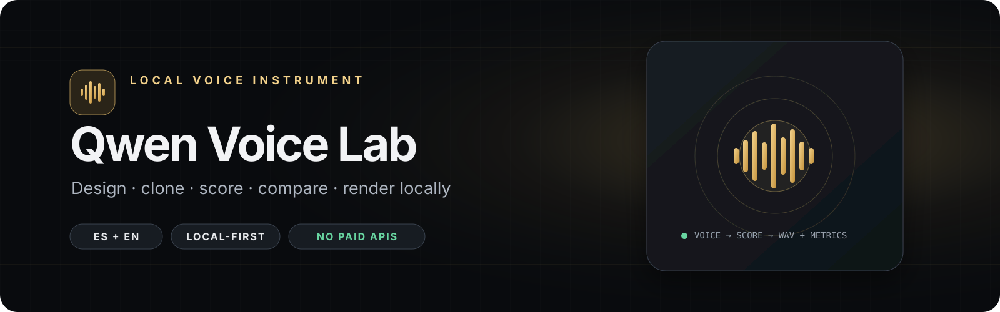
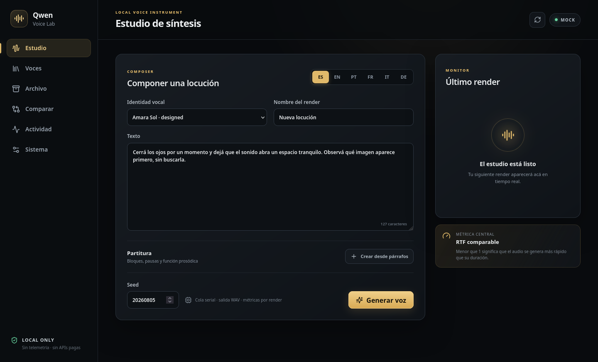
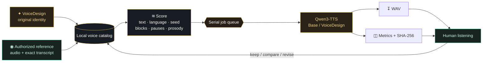
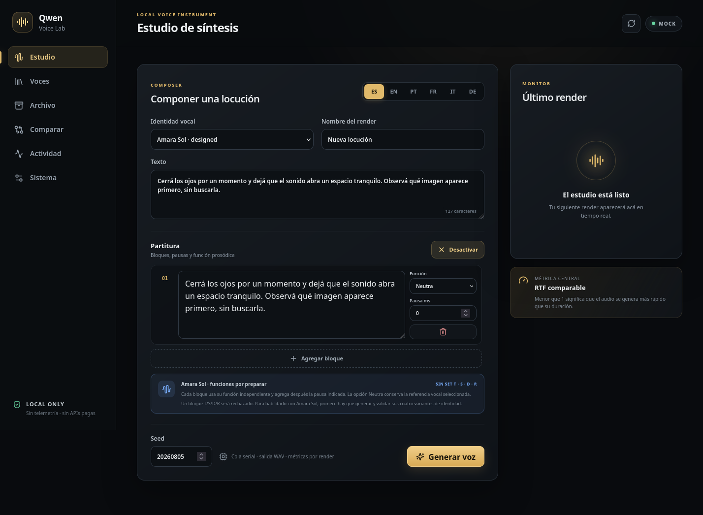
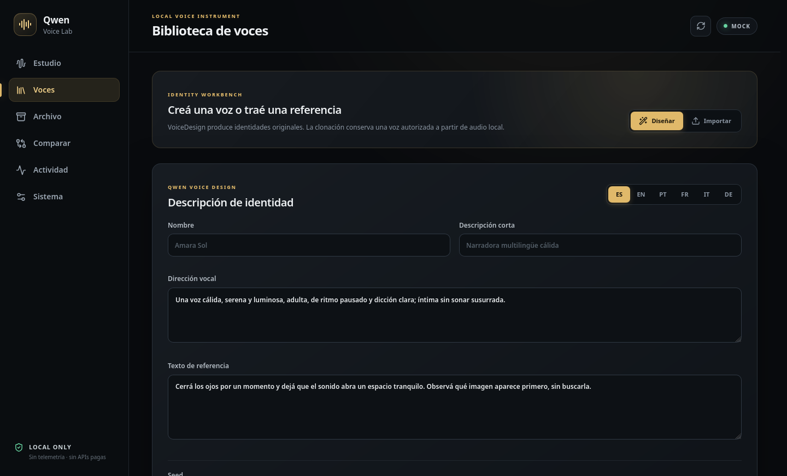
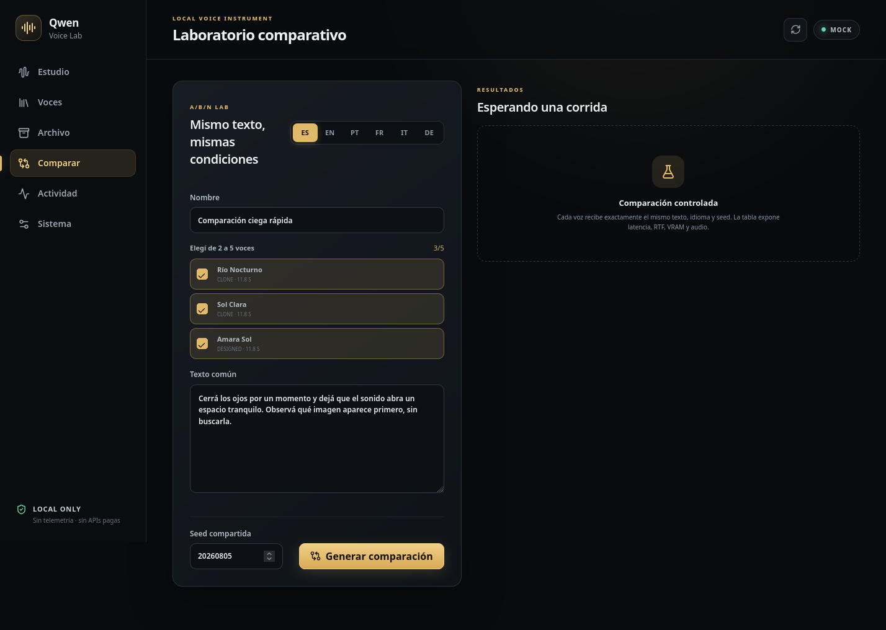
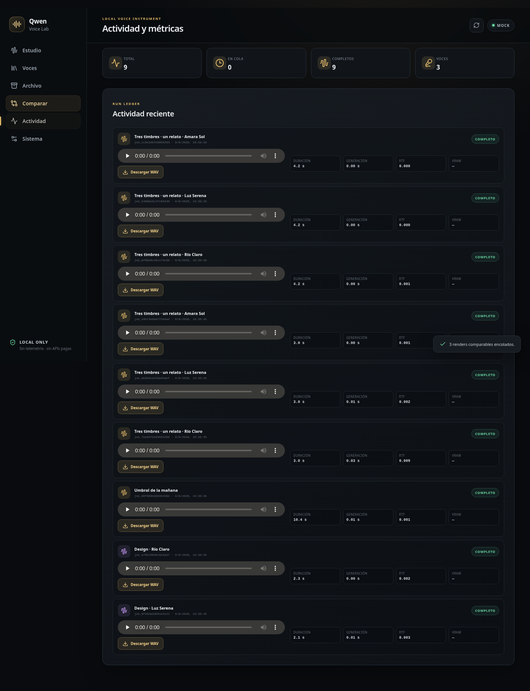
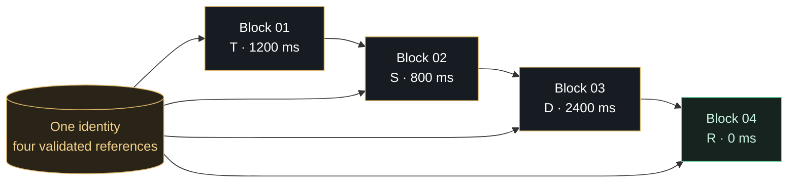
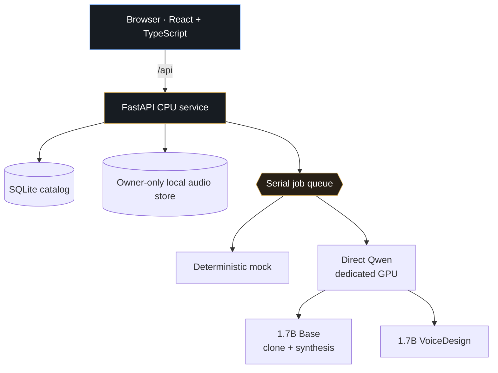

<!-- markdownlint-disable MD013 MD026 MD033 MD034 MD041 -->

<div align="center">



### A local-first studio for designing, cloning, scoring and comparing multilingual voices with Qwen3-TTS.

*Turn a voice identity and an exact text into a reproducible WAV — with block-level timing, controlled comparisons and metrics attached to every render.*

[](LICENSE)     

</div>

---

Voice work is easy to generate and hard to evaluate. A promising identity can disappear among anonymous WAVs; two engines get compared with different texts; a pause changes but nobody records it; a finished render loses its connection to the settings that produced it.

**Qwen Voice Lab makes the experiment the product.** It keeps identity, text, language, seed, score, output, timing and hardware metrics in one local workflow. VoiceDesign creates original synthetic identities. Authorized recordings can become reusable clone references. A serial queue renders through Qwen locally, while the interface preserves enough evidence to listen, compare and reproduce the result.

<p align="center">
  
</p>

<p align="center"><sub>The Studio: one voice, one exact score, one durable render with playback, download and metrics.</sub></p>

## Contents

- [What it does](#what-it-does)
- [The voice pipeline](#-the-voice-pipeline)
- [Interface](#interface)
- [Quickstart](#quickstart)
- [Real Qwen mode](#real-qwen-mode)
- [Scored prosody](#scored-prosody)
- [Architecture](#architecture)
- [Security and consent](#security-and-consent)
- [API and automation](#api-and-automation)
- [Validation](#validation)
- [Repository layout](#repository-layout)
- [Documentation and license](#documentation-and-license)

## What it does

| | Capability | What the lab preserves |
|---|---|---|
| ✦ | **Design original voices** | VoiceDesign instruction, carrier text, language, seed, sample WAV and explicit promotion decision |
| ◉ | **Clone authorized references** | Exact transcript, consent confirmation, audio hash, duration, tags and local provenance |
| ≋ | **Compose scored locutions** | Ordered text blocks, exact post-block pauses and per-block `neutral` / `T` / `S` / `D` / `R` labels |
| A/B | **Compare 2–5 identities** | The same text, language and seed for every voice in the run |
| ↧ | **Recover every result** | Persistent job history, browser playback and direct WAV download from Studio, Compare and Activity |
| ◫ | **Measure the render** | Model load, generation, first audio, duration, RTF, peak VRAM, byte size and SHA-256 |
| ⛨ | **Keep the boundary local** | No telemetry, no paid voice provider and no remote fallback |

Imported voices, generated audio, model weights, SQLite state and private prosody profiles live under the local data root and remain outside Git.

---

## 🎛 The voice pipeline

The core object is not “an audio file.” It is a traceable path from **identity** to **score** to **render**.



### Two identity paths, one evaluation contract

| | Synthetic design | Authorized clone |
|---|---|---|
| **Input** | Vocal direction + sample text + seed | Local recording + exact transcript + permission |
| **Model** | Qwen3-TTS VoiceDesign | Qwen3-TTS Base |
| **Catalog entry** | Only after listening and choosing **Add to my voices** | Created after validation and local import |
| **Best use** | Original product voices, rapid identity exploration | Reproducing a voice the operator is allowed to use |
| **Human gate** | Perceptual approval before promotion | Consent before import; perceptual review after render |

> **Generation is not promotion.** A VoiceDesign sample can render successfully and still be the wrong voice. The lab never adds it to the reusable catalog without an explicit human choice.

## Interface

| Studio and scored blocks | Voice design and catalog |
|---|---|
|  |  |
| **Compose exact text.** Split paragraphs into blocks, set the silence after each block and select an identity-specific function. | **Create, listen, then keep.** A completed sample remains separate until it is explicitly promoted. |

| Controlled comparison | Activity and durable downloads |
|---|---|
|  |  |
| **One text, one language, one seed.** Compare two to five identities without changing the prompt between them. | **Changing tabs loses nothing.** Completed work stays playable and downloadable from the run ledger. |

The screenshots use the deterministic CPU mock and public synthetic examples. They contain no private voice catalog or deployment data.

## Quickstart

The mock engine exercises the complete product workflow without CUDA. It produces deterministic diagnostic audio, not a quality sample of Qwen synthesis.

```bash
git clone https://github.com/Mar-IA-no/qwen-voice-lab.git
cd qwen-voice-lab
./scripts/bootstrap.sh
./scripts/run_dev.sh
```

Open `http://127.0.0.1:5173`. The API and interactive OpenAPI schema run at
`http://127.0.0.1:8788/docs`.

A fresh catalog starts with **Amara Sol**, an original bilingual synthetic identity released as CC0. In mock mode its workflows produce diagnostic tones; in Qwen mode the bundled synthetic reference conditions real synthesis.

### Prerequisites

| Component | Development / mock | Real Qwen synthesis |
|---|---|---|
| Python | 3.11–3.13 | 3.11–3.13 |
| Node | Current LTS with npm | Only required to rebuild the frontend |
| GPU | Not required | NVIDIA CUDA GPU |
| Models | None | Qwen3-TTS 1.7B Base; VoiceDesign when creating identities |

## Real Qwen mode

```bash
uv sync --extra qwen --extra dev
cp .env.example .env
uv run hf download Qwen/Qwen3-TTS-12Hz-1.7B-Base
uv run hf download Qwen/Qwen3-TTS-12Hz-1.7B-VoiceDesign
# Set QVL_ENGINE=qwen in .env.
./scripts/run_gpu.sh
```

The Base model performs cloning and synthesis from reusable references. VoiceDesign is needed only while creating original identities. Once dependencies and models are present locally, the voice runtime has no paid provider or remote fallback.

This is the normal deployment: `QVL_REQUIRE_GPU_WRAPPER=false` and Qwen uses
the configured CUDA device directly. No external scheduler or admission
controller is required on a dedicated machine.

### Practical hardware targets

These are operating recommendations from the validated 1.7B setup, not universal hardware floors.

| Use | VRAM | System RAM | Disk reservation |
|---|---:|---:|---:|
| Clone and render with Base | 8 GiB practical target | 16 GiB minimum | ~15 GiB |
| Base + VoiceDesign workflow | 12 GiB safer headroom | 32 GiB comfortable | ~25 GiB |

Real-engine smokes cover Base cloning, VoiceDesign generation and multi-block profile switching through the same queue used by the web application. They establish end-to-end operation on a CUDA workstation; they do not establish a quality threshold for every speaker, language or GPU.

<details>
<summary><b>Optional: coordinate Qwen on a shared GPU host</b></summary>

If several applications intentionally share one GPU, Voice Lab can launch only
its lazy Qwen worker through an external admission controller. This is an
optional deployment adapter, not a product prerequisite. A compatible public
reference implementation is
[`gpu-priorityd`](https://github.com/Mar-IA-no/gpu-priorityd):

```dotenv
QVL_REQUIRE_GPU_WRAPPER=true
QVL_GPU_WRAPPER="sudo gpu-priority --config /etc/gpu-priorityd.toml run"
QVL_GPU_JOB_NAME=qwen-voice-lab
QVL_GPU_CGROUP_PATTERN=(gpu-priority-job-[0-9]+-qwen-voice-lab[.]service)
QVL_GPU_UNIT_PREFIX=gpu-priority-job-
QVL_GPU_RETRYABLE_EXIT_CODES=1,75
QVL_GPU_STOP_COMMAND="sudo gpu-priority --config /etc/gpu-priorityd.toml cancel --unit {unit}"
QVL_GPU_STOP_ALL_COMMAND="sudo gpu-priority --config /etc/gpu-priorityd.toml cancel --name qwen-voice-lab"
```

`QVL_GPU_WRAPPER` is parsed as an argument-vector prefix, without a shell; Voice
Lab appends `--name … -- <worker command>`. Configure narrowly scoped privilege
for the exact `run` and `cancel` forms above, then complete the controller's
host acceptance sequence before enabling this mode.

The web server, catalog and serial queue remain in CPU. The first real render asks the controller for a reusable Qwen worker; only that worker enters CUDA. It verifies its admission marker and Linux cgroup before loading a model, stays alive for the configured idle window and exits afterward.

If a higher-priority workload preempts it, the active render fails explicitly while the UI, catalog, history and completed downloads remain online. A cooldown prevents queued comparison jobs from relaunching the controller in a tight loop. A later explicit job requests a fresh worker automatically.

See [`docs/ARCHITECTURE.md`](docs/ARCHITECTURE.md) for the full lifecycle and [`deploy/qwen-voice-lab.service.example`](deploy/qwen-voice-lab.service.example) for a sanitized persistent-service template.

</details>

<details>
<summary><b>Remote browser access</b></summary>

The safe default is loopback. From another computer, tunnel it:

```bash
ssh -L 8788:127.0.0.1:8788 user@inference-host
```

Then open `http://127.0.0.1:8788`. A non-loopback bind requires a token of at least 32 characters unless the operator deliberately enables the unauthenticated override. Use `QVL_COOKIE_SECURE=true` behind HTTPS, bind to a specific trusted interface and never expose the raw service on `0.0.0.0` to an untrusted network.

</details>

### Deployment and rollback boundary

Before deploying a release that expands persisted enum values, drain the queue,
record the current Git commit and take a versioned, restorable snapshot of the
local catalog. At minimum, preserve `qwen_voice_lab.sqlite3`, `voices/` and
`prosody_profiles/` from the configured `QVL_DATA_DIR`; a full data-root snapshot
is preferred when storage permits. Use an SQLite-aware backup while the service
is online, or stop the service before copying the database and its WAL files.

If a rollback happens after PT/FR/IT/DE `Voice` or `Comparison` records have been
written, restore the matching pre-deployment catalog snapshot before starting the
older release. A code-only rollback is not sufficient because the older model
contract cannot deserialize those newer enum values. Verify the snapshot on the
host before enabling broad multilingual writes.

## Scored prosody

A score contains **1–64 ordered blocks**. Every block preserves three things:

```json
{
  "id": "p02",
  "text": "Notice how the scene changes when the rhythm opens.",
  "pause_after_ms": 2400,
  "prosody": "D"
}
```

| Field | Contract |
|---|---|
| `text` | Synthesized exactly as the content of that block |
| `pause_after_ms` | Silence appended **after** the block; `1000` = one second |
| `prosody` | `neutral`, `T`, `S`, `D` or `R` |

`neutral` uses the selected catalog reference. T/S/D/R select the matching reference from a complete local profile for **that same identity and requested language**. A functional score is rejected before queueing when the voice has no complete profile or the profile does not declare the requested language.



These are identity-conditioned references, not universal style transforms. One voice's T/S/D/R set is never transferred to another voice. See [`docs/PROSODY_RUNTIME_MVP.md`](docs/PROSODY_RUNTIME_MVP.md).

## Architecture



The queue is the only route to generation. Jobs move through `queued → running → complete`, with `failed` and `cancelled` as terminal alternatives. Switching between Base and VoiceDesign unloads the current model before loading the other one. Reference prompts are cached only in worker memory.

On a shared host, the optional adapter replaces `DIRECT` with an admitted,
reusable worker; the voice, queue and rendering contracts remain unchanged.

### Operational shape

<div align="center">

| Contract | Value |
|---|---:|
| Concurrent GPU workers | **1 serial worker** |
| Voices per controlled comparison | **2–5** |
| Blocks per score | **1–64** |
| Languages | **ES + EN + PT + FR + IT + DE** |
| Render format | **WAV** |
| Paid voice providers | **0** |
| Durable metadata store | **1 local SQLite catalog** |
| Bundled public identities | **1 · Amara Sol** |

</div>

## Security and consent

The active risks are not abstract: an unauthorized voice can be cloned, a private reference can leak into Git, or an optionally controlled GPU worker can bypass admission. The product fails closed around each boundary it can enforce.

| Risk | Product defense |
|---|---|
| A human voice is imported without an operator decision | Multipart import requires `consent_confirmed=true`; the operator remains responsible for real permission |
| Private audio or state reaches the public repository | `data/`, recordings, renders, model formats, databases, profiles and environment files are ignored; only the reviewed CC0 starter is versioned |
| A file endpoint escapes its storage root | Voice, render and archive responses resolve and re-check containment before serving |
| A remote bind is exposed casually | Loopback by default; remote binding requires authentication or an explicit unsafe override |
| An optional shared-host worker enters CUDA outside admission | Marker + cgroup verification before model load; dedicated mode has no external scheduler |
| A higher-priority workload preempts the worker | Render fails explicitly; API and completed results survive; cooldown prevents relaunch loops |
| A paid provider receives text or audio | No paid provider, telemetry client or remote voice fallback exists |

One installation has one access token, not per-user roles. Every authenticated user of that installation can see its populated catalog and archive; restrict the tunnel, VPN or reverse proxy accordingly. Read the complete boundary in [`SECURITY.md`](SECURITY.md).

## API and automation

The React interface uses the same documented FastAPI contract available at `/docs` and `/openapi.json`.

<details>
<summary><b>Endpoint map</b></summary>

| Endpoint | Purpose |
|---|---|
| `GET /api/auth/status` | Report browser authentication state |
| `POST /api/auth/session` | Exchange the installation token for an HttpOnly session cookie |
| `GET /api/capabilities` | Engine, models, limits, languages and worker state |
| `GET /api/voices` | Voice catalog and prosody readiness |
| `POST /api/voices` | Import an authorized multipart reference |
| `POST /api/designs` | Queue a VoiceDesign sample |
| `POST /api/jobs/{id}/promote` | Add an accepted design sample to the catalog |
| `POST /api/jobs` | Queue neutral or scored synthesis |
| `GET /api/jobs/{id}` | Observe one durable job |
| `DELETE /api/jobs/{id}` | Cancel queued or running work |
| `POST /api/comparisons` | Queue a controlled multi-voice comparison |
| `GET /api/comparisons/{id}` | Recover a comparison and its jobs |
| `GET /api/jobs/{id}/audio` | Stream a completed WAV |
| `GET /api/jobs/{id}/download` | Download a completed WAV |
| `GET /api/archive` | List local archived audio without host paths |
| `GET /api/catalog/export` | Export non-audio catalog metadata |

</details>

For agent behavior, payload examples, polling, preemption and retry policy, use the [agent usage guide](docs/AGENT_USAGE_GUIDE.md).

<details>
<summary><b>Private archive import</b></summary>

An authorized operator can populate one instance without publishing its corpus:

```bash
uv run python scripts/import_private_archive.py \
  --source /path/to/authorized-corpus \
  --related-assets /path/to/related-assets \
  --profile /path/to/private-import-profile.json \
  --data-dir ./data \
  --confirm-authorized
```

The operation is idempotent. It copies the corpus outside Git, registers configured references and exposes archived audio through **Archive**. The confirmation flag records an operator decision; it is not a substitute for actual permission.

</details>

## Validation

The ordinary CI contract requires no CUDA:

- Ruff over Python source and tests;
- backend API, storage, consent and queue tests;
- clean frontend install and TypeScript/Vite production build;
- packaged-frontend reproducibility;
- Python wheel and source-distribution builds;
- explicit checks for remote authentication, path privacy, per-block references, cancellation, comparison controls, downloads, GPU admission and the absence of paid providers.

An opt-in root-only suite uses real transient `systemd-run` units with a fake non-CUDA worker to verify cancellation and shutdown cleanup. See [`docs/VALIDATION.md`](docs/VALIDATION.md) for the exact evidence boundary.

```bash
./scripts/bootstrap.sh
make test
make build
```

Perceptual promotion remains a human decision. A distinct hash, a successful load or a complete T/S/D/R manifest does not by itself make a voice good or a profile canonical.

## Repository layout

<details>
<summary><b>Expand the tree</b></summary>

```text
qwen-voice-lab/
├── src/qwen_voice_lab/      FastAPI, queue, engines, storage and starter voice
├── frontend/                React + TypeScript instrument UI
├── tests/                   API, queue, optional adapter and lifecycle contracts
├── scripts/                 bootstrap, builds, archive import and GPU entrypoints
├── deploy/                  sanitized service and helper templates
├── docs/                    architecture, validation, prosody and user manuals
├── data/                    local catalog, voices and renders — ignored
├── .env.example             shareable configuration surface
├── SECURITY.md              trust, consent, network and GPU boundaries
└── pyproject.toml           Python package and pinned Qwen extra
```

</details>

## Documentation and license

| Audience | Document |
|---|---|
| Human operators | [Visual user manual · Spanish PDF](docs/user-guide/Qwen_Voice_Lab_Manual_de_Uso_ES.pdf) |
| Editable manual source | [A4 landscape HTML guide](docs/user-guide/guide.html) |
| Agents and API clients | [Operational agent guide](docs/AGENT_USAGE_GUIDE.md) |
| Runtime implementers | [Architecture contract](docs/ARCHITECTURE.md) |
| Security reviewers | [Security and privacy](SECURITY.md) |

- Application code: [MIT](LICENSE).
- Amara Sol starter audio and metadata: CC0 1.0; see the [starter voice notice](src/qwen_voice_lab/starter_voices/README.md).
- Qwen3-TTS: Apache 2.0; see [third-party notices](THIRD_PARTY_NOTICES.md).

The bundled starter is an original synthetic voice, not a recording or clone of a human speaker. Imported recordings retain their own rights and require authorization from the speaker.

---

<div align="center">
<sub>Built as an instrument: listen, compare, preserve the evidence.</sub>
</div>
